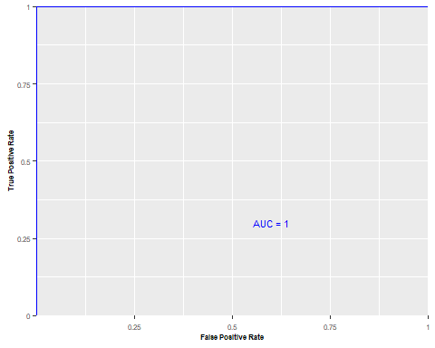
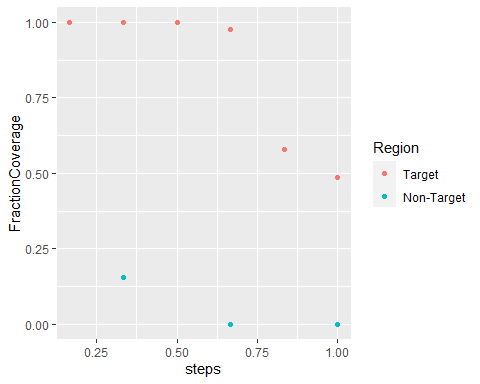
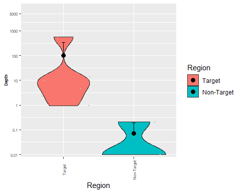
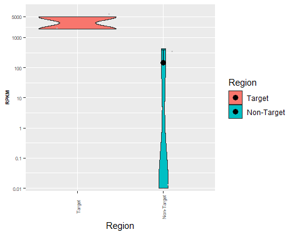
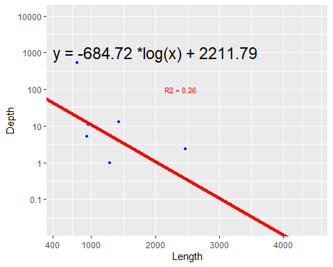
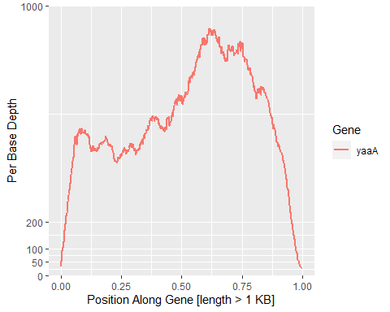
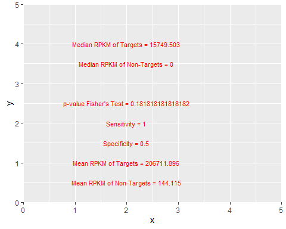
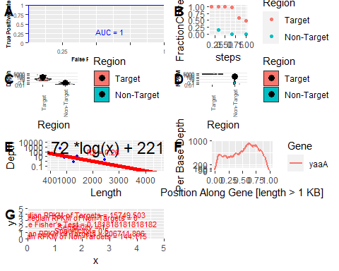

```r
# loading all the required packages

rm(list=ls())
library(tidyverse)
library(seqinr)
library(plyr)
library(dplyr)
library(cowplot)
library(ggplot2)
library(Rsamtools)
library(sfsmisc)
#devtools::install_github("sachsmc/plotROC")
library(plotROC)
library(mygene)
```


```r
format_data <- function(input, datatype) {
  if(datatype == "fraction") {
    output <- read.table(input, header = FALSE)
    names(output)<-c("Chromosome","Start","Stop","Gene",  "Strand", "Reads", "BasesCovered", "Length", "FractionCoverage")
  }
    
  else if(datatype == "depth") {
    output <- read.table(input, header = FALSE)
    names(output)<-c("Chromosome","Start","Stop","Gene",  "Strand" , "Depth")
  }
    
  else {
    output <- read.table(input, header = TRUE)
  }
    return(output)
  }
```


```r
# REading depth files

targetsData <- format_data("../Data/sample_files/targetstrimmomaticCapture-200-2ML-E_coli_S4_R1_001.fastq.gz.sam.bam.Sorted.bed.out", "fraction")

nontargetsData <- format_data("../Data/sample_files/nontargetstrimmomaticCapture-200-2ML-E_coli_S4_R1_001.fastq.gz.sam.bam.Sorted.bed.out", "fraction")

complementData <- format_data("../Data/sample_files/complementtrimmomaticCapture-200-2ML-E_coli_S4_R1_001.fastq.gz.sam.bam.Sorted.bed.out", "fraction")

head(targetsData)
```

```
##                      Chromosome Start Stop Gene Strand Reads BasesCovered
## 1 gi|556503834|ref|NC_000913.3|   337 2799 thrA      +   116         1201
## 2 gi|556503834|ref|NC_000913.3|  2801 3733 thrB      +    95          909
## 3 gi|556503834|ref|NC_000913.3|  3734 5020 thrC      +    24          744
## 4 gi|556503834|ref|NC_000913.3|  5683 6459 yaaA      -  8885          776
## 5 gi|556503834|ref|NC_000913.3|  6529 7959 yaaJ      -   355         1430
## 6 gi|556503834|ref|NC_000913.3|  8238 9191 talB      +   195          953
##   Length FractionCoverage
## 1   2462        0.4878148
## 2    932        0.9753219
## 3   1286        0.5785381
## 4    776        1.0000000
## 5   1430        1.0000000
## 6    953        1.0000000
```


```r
targetsDataDepth <- format_data("../Data/sample_files/targetsdtrimmomaticCapture-200-2ML-E_coli_S4_R1_001.fastq.gz.sam.bam.Sorted.bed.out", "depth")

nontargetsDataDepth <- format_data("../Data/sample_files/nontargetsdtrimmomaticCapture-200-2ML-E_coli_S4_R1_001.fastq.gz.sam.bam.Sorted.bed.out", "depth")

complementDataDepth <- format_data("../Data/sample_files/complementdtrimmomaticCapture-200-2ML-E_coli_S4_R1_001.fastq.gz.sam.bam.Sorted.bed.out", "depth")

head(targetsDataDepth)
```

```
##                      Chromosome Start Stop Gene Strand       Depth
## 1 gi|556503834|ref|NC_000913.3|   337 2799 thrA      +   2.3484972
## 2 gi|556503834|ref|NC_000913.3|  2801 3733 thrB      +   4.9645925
## 3 gi|556503834|ref|NC_000913.3|  3734 5020 thrC      +   0.9191291
## 4 gi|556503834|ref|NC_000913.3|  5683 6459 yaaA      - 576.2500000
## 5 gi|556503834|ref|NC_000913.3|  6529 7959 yaaJ      -  12.4909086
## 6 gi|556503834|ref|NC_000913.3|  8238 9191 talB      +  10.3084993
```


```r
# Read ATGC content, and also other features of the gene #
ATGC_content <- format_data("../Data/GC_content_k12/targetsCoverageATGC.txt", "NA")

non_ATGC_content <- format_data("../Data/GC_content_k12/nontargetsCoverageATGC.txt", "NA")

comp_ATGC_content <- format_data("../Data/GC_content_k12/complementCoverageATGC.txt", "NA")

head(ATGC_content)
```

```
##                      Chromosome Start Stop Gene Strand   PCT_AT   PCT_GC NUM_A
## 1 gi|556503834|ref|NC_000913.3|   337 2799 thrA      + 0.469131 0.530869   552
## 2 gi|556503834|ref|NC_000913.3|  2801 3733 thrB      + 0.436695 0.563305   194
## 3 gi|556503834|ref|NC_000913.3|  3734 5020 thrC      + 0.471229 0.528771   304
## 4 gi|556503834|ref|NC_000913.3|  5683 6459 yaaA      - 0.502577 0.497423   187
## 5 gi|556503834|ref|NC_000913.3|  6529 7959 yaaJ      - 0.466434 0.533566   409
## 6 gi|556503834|ref|NC_000913.3|  8238 9191 talB      + 0.479538 0.520462   251
##   NUM_C NUM_G NUM_T NUM_N NUM_OTHER Length
## 1   615   692   603     0         0   2462
## 2   231   294   213     0         0    932
## 3   316   364   302     0         0   1286
## 4   197   189   203     0         0    776
## 5   394   369   258     0         0   1430
## 6   241   255   206     0         0    953
```


```r
# Merge all the read files individually for targets, non-targets etc
targetsDataD<-merge(targetsData, targetsDataDepth, by=intersect(names(targetsData), names(targetsDataDepth)))

nontargetsDataD<-merge(nontargetsData, nontargetsDataDepth, by=intersect(names(nontargetsData), names(nontargetsDataDepth)))

complementDataD<-merge(complementData, complementDataDepth, by=intersect(names(complementData), names(complementDataDepth)))
```


```r
# Merge above files to include ATGC related files too # Everything at one place
targetsAllData<-merge(targetsDataD, ATGC_content, by=intersect(names(targetsDataD), names(ATGC_content)))

nontargetsAllData<-merge(nontargetsDataD, non_ATGC_content, by=intersect(names(nontargetsDataD), names(non_ATGC_content)))

complementAllData<-merge(complementDataD, comp_ATGC_content, by=intersect(names(complementDataD), names(comp_ATGC_content)))

head(targetsAllData)
```

```
##                      Chromosome Start Stop Gene Strand Length Reads
## 1 gi|556503834|ref|NC_000913.3|  2801 3733 thrB      +    932    95
## 2 gi|556503834|ref|NC_000913.3|   337 2799 thrA      +   2462   116
## 3 gi|556503834|ref|NC_000913.3|  3734 5020 thrC      +   1286    24
## 4 gi|556503834|ref|NC_000913.3|  5683 6459 yaaA      -    776  8885
## 5 gi|556503834|ref|NC_000913.3|  6529 7959 yaaJ      -   1430   355
## 6 gi|556503834|ref|NC_000913.3|  8238 9191 talB      +    953   195
##   BasesCovered FractionCoverage       Depth   PCT_AT   PCT_GC NUM_A NUM_C NUM_G
## 1          909        0.9753219   4.9645925 0.436695 0.563305   194   231   294
## 2         1201        0.4878148   2.3484972 0.469131 0.530869   552   615   692
## 3          744        0.5785381   0.9191291 0.471229 0.528771   304   316   364
## 4          776        1.0000000 576.2500000 0.502577 0.497423   187   197   189
## 5         1430        1.0000000  12.4909086 0.466434 0.533566   409   394   369
## 6          953        1.0000000  10.3084993 0.479538 0.520462   251   241   255
##   NUM_T NUM_N NUM_OTHER
## 1   213     0         0
## 2   603     0         0
## 3   302     0         0
## 4   203     0         0
## 5   258     0         0
## 6   206     0         0
```


```r
## Reviewers requested to merge Non-target and intergenic and name them as non-targets or we can call them off-targets ##
targetsAllData$Region="Target"
nontargetsAllData$Region="Non-Target"
complementAllData$Region="Non-Target"

#complementAllData$Strand<-'NA'
#complementAllData$Gene<-'NA'

# Since we defined the regions, we have a variable that tells us which region does the gene corresponds too, so now we can make one large data-frame for all the analyses #
test<-rbind(targetsAllData,nontargetsAllData)
allData<-rbind(test,complementAllData)
# # NOT REQUIRED # # allData$Depth<-allData$Reads/allData$Length

# Just for plotting labels of the violin plots #
levels(allData$Region)<-levels(allData$Region)[2:1]
allData$Region <- factor(allData$Region, levels = c("Target", "Non-Target"))

# Caclulate RPKM, using the number of reads per gene, total number of reads and the length of the gene, for easier comparison across different samples #
# We interchangeable used FPKM, but here we mean RPKM, because it is SE data (single end, not paired-end, at least the current dataset for the paper)
totalReads<-sum(allData$Reads)
allData$FPKM<-(1e9/totalReads)*(allData$Reads/allData$Length)

# We looked only for the regions that are at least 400 bases!

# only targets, non-targes and intergenic regions
filteredData <- subset(allData, (Length >= 400), select=c(Reads, Depth, Region, Length, FractionCoverage, FPKM))
# # NOT REQUIRED # # filteredData$Depth<-filteredData$Depth*RL
filteredData
```

```
##    Reads       Depth     Region Length FractionCoverage         FPKM
## 1     95   4.9645925     Target    932        0.9753219   10473.8317
## 2    116   2.3484972     Target   2462        0.4878148    4841.3652
## 3     24   0.9191291     Target   1286        0.5785381    1917.6448
## 4   8885 576.2500000     Target    776        1.0000000 1176504.5487
## 5    355  12.4909086     Target   1430        1.0000000   25508.8110
## 6    195  10.3084993     Target    953        1.0000000   21025.1746
## 7      3   0.2117812 Non-Target    713        0.1542777     432.3442
## 8      0   0.0000000 Non-Target   1916        0.0000000       0.0000
## 10     0   0.0000000 Non-Target    905        0.0000000       0.0000
```


```r
# Only targets and non-targets
filteredDataTNT <- subset(allData, (Length >= 400) & ( Region == "Target" | Region == "Non-Target"), select=c(Reads, Depth, Region, Length, FractionCoverage, FPKM))
filteredDataTNT$D<-NULL
filteredDataTNT$D[which(filteredDataTNT$Region=="Target")]<-1
filteredDataTNT$D[which(filteredDataTNT$Region=="Non-Target")]<-0
filteredDataTNT$M<-filteredDataTNT$Depth

filteredDataTNT
```

```
##    Reads       Depth     Region Length FractionCoverage         FPKM D
## 1     95   4.9645925     Target    932        0.9753219   10473.8317 1
## 2    116   2.3484972     Target   2462        0.4878148    4841.3652 1
## 3     24   0.9191291     Target   1286        0.5785381    1917.6448 1
## 4   8885 576.2500000     Target    776        1.0000000 1176504.5487 1
## 5    355  12.4909086     Target   1430        1.0000000   25508.8110 1
## 6    195  10.3084993     Target    953        1.0000000   21025.1746 1
## 7      3   0.2117812 Non-Target    713        0.1542777     432.3442 0
## 8      0   0.0000000 Non-Target   1916        0.0000000       0.0000 0
## 10     0   0.0000000 Non-Target    905        0.0000000       0.0000 0
##              M
## 1    4.9645925
## 2    2.3484972
## 3    0.9191291
## 4  576.2500000
## 5   12.4909086
## 6   10.3084993
## 7    0.2117812
## 8    0.0000000
## 10   0.0000000
```


```r
# ROC plot
ROCplot <- ggplot(filteredDataTNT, aes(d = D, m = M)) + geom_roc(n.cuts = 0, color = "blue")+
  labs(x="False Positive Rate", y = "True Positive Rate")+
  #+style_roc()
theme(axis.title.y = element_text(face="bold", colour="black", size=6),axis.text.y  = element_text(vjust=0.5, size=6),
axis.title.x =element_text(face="bold", colour="black", size=6),axis.text.x  = element_text(vjust=0.5, size=6))+
  scale_y_continuous(expand=c(0,0),breaks=c(0,.25,.5,.75,1),labels=c(0,.25,.5,.75,1))+
  scale_x_continuous(expand=c(0,0),breaks=c(.25,.5,.75,1),labels=c(.25,.5,.75,1))
ROCplot<-ROCplot+annotate("text", x = .6, y = .3, size=3, color="blue",
           label = paste("AUC =", round(calc_auc(ROCplot)$AUC, 3))) 
ROCplot
```

<!-- -->

```r
ggsave("ROCplot.pdf")
```


```r
###################################################

# For fraction coverage plot, we need to bring everything to the same end, i.e., even though there is difference in number of targets and non-targets which is  most likely the case in almost all the scenarios, for plotting fraction coverage plot, we make sure we stretch the lower number of regions to match the regions that are more! Please see the fraction coverage plot and see where the 2 curves end and you will understand better.

adjust<-length(filteredData$FractionCoverage[which(filteredData$Region=="Target")])/length(filteredData$FractionCoverage[which(filteredData$Region=="Non-Target")])


stepsNontarget<-seq(adjust, length(filteredData$FractionCoverage[which(filteredData$Region=="Target")]), by=adjust)


stepsTarget<-seq(1,length(filteredData$FractionCoverage[which(filteredData$Region=="Target")]), by=1)

filteredData<-filteredData[order(-filteredData$FractionCoverage), ]
filteredData$steps<-0
filteredData$steps[which(filteredData$Region=="Target")]<-stepsTarget
filteredData$steps[which(filteredData$Region=="Non-Target")]<-stepsNontarget
#filteredData$steps[which(filteredData$Region=="Intergenic")]<-stepsIntergenic
filteredData$steps<-filteredData$steps/length(stepsTarget)


FractionCoveragePlot<-ggplot(filteredData,aes(x=steps, y=FractionCoverage, colour = Region)) + geom_point()#, xlim=c(1,4800), ylim = c(0,1),  xlab = "Index (arbitrary units)", ylab = "Fraction of sequence covered")
FractionCoveragePlot
```

<!-- -->

```r
ggsave("FractionCoveragePlot.pdf")
#dev.off()
```


```r
# We looked at both depth and RPKM, and in the violin plots we used mean and SE for the error bars. But we also provided numbers for the median (Depth, RPKM) for all the regions across different samples, in the manuscript.

fD2<-filteredData
fD2$DepthMean<-0
fD2$DepthSD<-0

fD2$DepthMean[which(fD2$Region=="Target")]<-mean(fD2$Depth[which(fD2$Region=="Target")])
fD2$DepthMean[which(fD2$Region=="Non-Target")]<-mean(fD2$Depth[which(fD2$Region=="Non-Target")])


fD2$DepthSD[which(fD2$Region=="Target")]<-sd(fD2$Depth[which(fD2$Region=="Target")])
fD2$DepthSD[which(fD2$Region=="Non-Target")]<-sd(fD2$Depth[which(fD2$Region=="Non-Target")])

fD2$FPKMMean<-0
fD2$FPKMSD<-0

fD2$FPKMMean[which(fD2$Region=="Target")]<-mean(fD2$FPKM[which(fD2$Region=="Target")])
fD2$FPKMMean[which(fD2$Region=="Non-Target")]<-mean(fD2$FPKM[which(fD2$Region=="Non-Target")])


fD2$FPKMSD[which(fD2$Region=="Target")]<-sd(fD2$FPKM[which(fD2$Region=="Target")])
fD2$FPKMSD[which(fD2$Region=="Non-Target")]<-sd(fD2$FPKM[which(fD2$Region=="Non-Target")])


Mean_Targets<-mean(fD2$FPKM[which(fD2$Region=="Target")])
Mean_NonTargets<-mean(fD2$FPKM[which(fD2$Region=="Non-Target")])

Median_Targets<-median(fD2$FPKM[which(fD2$Region=="Target")])
Median_NonTargets<-median(fD2$FPKM[which(fD2$Region=="Non-Target")])

# Just setting a base value for plotting purposes of depth of all targets and non-targets#
fD2$Depth[which(fD2$Depth<1e-2)]<-1e-2
fD2$FPKM[which(fD2$FPKM<1e-2)]<-1e-2
#pdf(file="//Users/Vish/Downloads/Lorenzo/pool/FASTQ/violin_plot.pdf", width = 15, height = 15)
VIOLINplot <- ggplot(fD2, aes(x=Region, y=Depth, fill=Region)) + 
geom_violin()+
geom_jitter( color = "grey", size = 0.001)+ 
geom_point(aes(y = DepthMean), color = "black", size = 3, data = fD2) + 
geom_errorbar(aes(y = DepthMean, ymin = DepthMean, ymax = DepthMean+DepthSD), color = "black", width = 0.05, data = fD2)+
labs(x="Region", y = "Depth")+
theme(axis.title.y = element_text(face="bold", colour="black", size=6),
axis.text.x  = element_text(angle=90, vjust=0.5, size=6), axis.text.y  = element_text(size=6))+
  scale_y_log10(limits=c(1e-2,10000),expand = c(0, 0.1), breaks=c(.01,.1,1,10,100,1000,5000),labels=c(.01,.1,1,10,100,1000,5000))
VIOLINplot
```

<!-- -->

```r
ggsave("VIOLINplot.pdf")
```


```r
# Since we calculated RPKM, we also plotted the RPKM here, for all targets and non-targets.
VIOLINFPKMplot <- ggplot(fD2, aes(x=Region, y=FPKM, fill=Region)) + 
geom_violin()+
geom_jitter( color = "grey", size = 0.001)+ 
geom_point(aes(y = FPKMMean), color = "black", size = 3, data = fD2) + 
geom_errorbar(aes(y = FPKMMean, ymin = FPKMMean, ymax = FPKMMean+FPKMSD), color = "black", width = 0.05, data = fD2)+
labs(x="Region", y = "RPKM")+
theme(axis.title.y = element_text(face="bold", colour="black", size=6),
axis.text.x  = element_text(angle=90, vjust=0.5, size=6), axis.text.y  = element_text(size=6))+
  scale_y_log10(limits=c(1e-2,10000),expand = c(0, 0.1), breaks=c(.01,.1,1,10,100,1000,5000),labels=c(.01,.1,1,10,100,1000,5000))
VIOLINFPKMplot
```

<!-- -->

```r
ggsave("VIOLINFPKMplot.pdf")
#dev.off()
```


```r
fD2Target<-filteredData[which(filteredData$Region=="Target" & filteredData$Depth>=0.001 ),]
model_eqn=lm(Depth~log10(Length), fD2Target)
model_log=lm(log10(Depth)~Length, fD2Target)


 
# We plotted depth (or RPKM) versus length, to see the longer capture fragments sequencing depth.
DepthCapturePlot <- ggplot(fD2Target, aes(x=Length, y=Depth)) + 
geom_jitter( color = "blue",size = 1)+ 
geom_abline(intercept=round(model_log$coefficients[1],3),
                      slope=round(model_log$coefficients[2],3), color = "red", size = 2)+
  scale_y_log10(limits=c(1e-2,20000),expand = c(0, 0), breaks=c(0.1,1,10,100,1000,10000),labels=c(0.1,1,10,100,1000,10000))+
  scale_x_continuous(limits=c(0,5000),expand = c(0, -300), breaks=c(400,1000,2000,3000,4000,5000),labels=c(400,1000,2000,3000,4000,5000))+
labs(x="Length", y = "Depth")+
annotate("text", x = 2000, y = 1000, size=6, color="black",
           label = paste("y =", round(model_eqn$coefficients[2],2), "*log(x)","+",round(model_eqn$coefficients[1],2)))+
  annotate("text", x = 2400, y = 100, size=3, color="red",
           label = paste("R2 =", round(summary(model_log)$r.squared,3)))
DepthCapturePlot
```

<!-- -->

```r
ggsave("DepthCapturePlot.pdf")
```


```r
# To plot the depth for each base, along the position of the gene to visually see how targets are captured, we used the data from a separate file #
# This clearly showed MIP probes, most of them being empty captured and hence the need to use the hundred bases filter i.e., remove 100 bases from the left and the right and focus on the middle region for different metrics #

fC<-read.table("../Data/sample_files/depthDGeneBGtrimmomaticCapture-200-2ML-E_coli_S4_R1_001.fastq.gz.sam.bam.Sorted.txt")
names(fC)<-c("chromosome","PositionLASSO","FrequencyLASSO")
f_gene<-targetsData
#names(f_gene)<-c("chromosome","Start","Stop", "Strand", "Gene", "Reads", "BasesCovered", "Length", "FractionCoverage")

library(IRanges)
iGene <- with(fC, IRanges(PositionLASSO, width=1, names=chromosome))
iDepth <- with(f_gene, IRanges(Start, Stop, names=Gene))
olaps <- findOverlaps(iGene, iDepth)
AlongGeneBases<-cbind(fC[queryHits(olaps),], f_gene[subjectHits(olaps),])
AlongGeneBases$PosIndex<-(AlongGeneBases$PositionLASSO-AlongGeneBases$Start)/AlongGeneBases$Length
filteredGeneCoverage <- subset(AlongGeneBases,((Length>=100)&(Reads>=10)), select=c(Gene, FrequencyLASSO, PosIndex, Reads, Length, FractionCoverage))
#pdf(file="/Users/Vish/Downloads/LASSO_Analyses/PerBaseDepth_AlongGene.pdf", width = 15, height = 15)
GeneCovered <- ggplot(filteredGeneCoverage, aes(x=PosIndex, y=FrequencyLASSO, fill=Gene)) +
   geom_line( aes(colour=Gene), size = 0.9)+
  labs(x="Position Along Gene [length > 1 KB]", y = "Per Base Depth")+
  scale_y_continuous(limits=c(0,1000),expand = c(0, 0), breaks=c(0,50,100,200,1000),labels=c(0,50,100,200,1000))+
  guides(fill=FALSE)
GeneCovered
```

<!-- -->

```r
ggsave("GeneCovered-200-2ML-E_coli_S4.pdf", width = 40, height = 40)
```


```r
# Calculating other metrics, such as p-value, sensitivity and specificity of the probes to capture the correct targets #

missedTargets<-targetsData$Gene[which(targetsData$FractionCoverage<=0.0000001)]

hitT<-length(which(targetsData$Reads>=1))
nohitT<-dim(targetsData)[1]-hitT
hitNT<-length(which(nontargetsData$Reads>=1))
nohitNT<-dim(nontargetsData)[1]-hitNT
LASSO_targets <-
matrix(c(hitT,nohitT,hitNT,nohitNT),
       nrow = 2,
       dimnames =
       list(c("True Positives", "False Positives"),
            c("Targets", "Non-Targets")))
fisher.test(LASSO_targets, conf.level = 0.99)$conf.int
```

```
## [1] 0.2238756       Inf
## attr(,"conf.level")
## [1] 0.99
```

```r
FT<-fisher.test(LASSO_targets, conf.int = FALSE)
Sens<-hitT/(hitT+nohitT)
Spec<-nohitNT/(hitNT+nohitNT)


# Putting all the metrics as a form of text and show it in the plot along with other figures #
df<-data.frame()
WriteText<-ggplot(df)+
  scale_x_continuous(limits=c(0,5),expand = c(0, 0))+
  scale_y_continuous(limits=c(0,5),expand = c(0, 0))+
annotate("text", y = 2.5, x = 2, size=3, color="red",
          label = paste("p-value Fisher's Test =", FT$p.value))+
annotate("text", y = 2.0, x = 2, size=3, color="red",
          label = paste("Sensitivity =", round(Sens,3)))+
annotate("text", y = 1.5, x = 2, size=3, color="red",
          label = paste("Specificity =", round(Spec,3)))+
  annotate("text", y = 1.0, x = 2, size=3, color="red",
          label = paste("Mean RPKM of Targets =", round(Mean_Targets,3)))+
annotate("text", y = 0.5, x = 2, size=3, color="red",
          label = paste("Mean RPKM of Non-Targets =", round(Mean_NonTargets,3)))+
annotate("text", y = 4.0, x = 2, size=3, color="red",
          label = paste("Median RPKM of Targets =", round(Median_Targets,3)))+
annotate("text", y = 3.5, x = 2, size=3, color="red",
          label = paste("Median RPKM of Non-Targets =", round(Median_NonTargets,3)))
WriteText
```

<!-- -->

```r
ggsave("WriteTextplot.pdf")
```


```r
# Combine everything generated above into one large PDF file for easy comparison across samples #
plot_grid(ROCplot, FractionCoveragePlot, VIOLINplot, VIOLINFPKMplot, DepthCapturePlot, GeneCovered, WriteText,  labels = "AUTO", ncol = 2)
```

<!-- -->

```r
ggsave("Capture-200-2ML-E_coli_S4.pdf", width = 40, height = 40)
```


